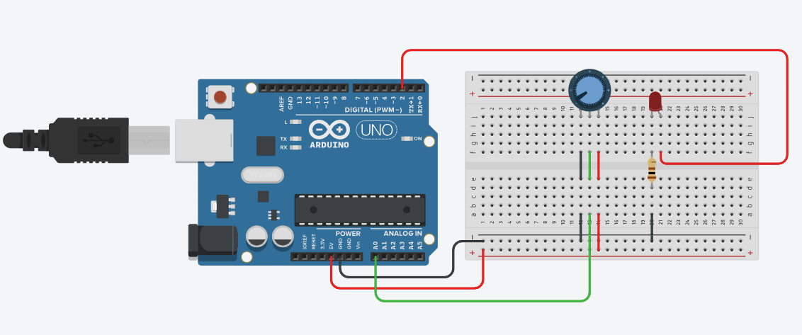

# Project 1: Potentiometer-Controlled LED Blink

## Project Description
An embedded system application that controls the blinking rate of an LED using an analog potentiometer. The system reads variable voltage inputs, scales the time intervals dynamically, and outputs real-time cycle data via the hardware Serial interface.

---

## Hardware Required
* 1 x Arduino UNO (or compatible development board)
* 1 x 5mm LED (Red/Green/Blue)
* 1 x 220Ω Resistor (Current-limiting for LED)
* 1 x 10kΩ Rotary Potentiometer
* 1 x Breadboard
* Premium Jumper Wires (M-M)

---

## Circuit Diagram Description
## Circuit Diagram Description


* **LED Path:** The positive terminal (Anode) of the LED connects to Digital Pin 2 through a 100Ω resistor. The negative terminal (Cathode) connects directly to the Ground (GND) rail.
* **Potentiometer Path:** Terminal 1 is wired to the 5V power pin on the Arduino. Terminal 3 connects to the Ground (GND) rail. The center pin (Wiper/Terminal 2) is connected to Analog Input Pin A0.

---

## How to Upload and Run the Code
1. Open the file `/week1/led_blink/led_blink.ino` using VS Code or your preferred environment.
2. If using a physical setup, connect your Arduino UNO to your PC via a USB cable. If using **Wokwi/Tinkercad**, copy this code block into the simulation code pane.
3. Verify and compile the program to ensure no syntax flags exist.
4. Upload the compiled binary target to the microcontroller board.
5. Launch the **Serial Monitor** set to a baud rate of `9600` to view execution metrics.

---

## Expected Output
* **Hardware Behavior:** Turning the rotary potentiometer shaft changes the LED's blinking rate seamlessly. Rotating it toward 5V decreases the loop delay (faster blink); rotating it toward GND increases the delay (slower blink).
* **Serial Monitor Stream:** Continuous lines printing current metrics in the format:
  ```text
  Blink count: 1 | Delay: 512 ms
  Blink count: 2 | Delay: 512 ms